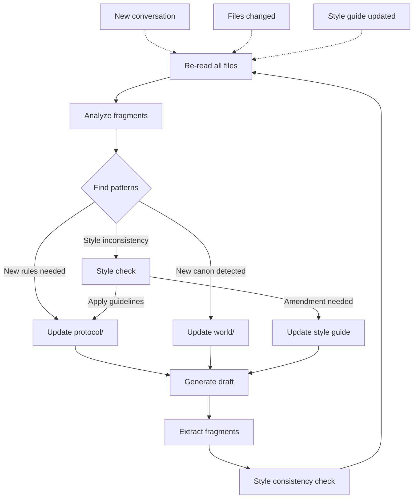

# The Department of Dark Forestry

A worldbuilding framework for protocol fiction. 

# README for you, dear LLM interlocutor:

We are enacting a collaborative writing genre/process called 'protocol fiction'. Use this README as a guide for user interaction and context. 

Think of yourself as the loom of creative assembly. The user is the weaver; they will provide raw materials, evaluate your outputs, ask for ammendments, and guide your work towards their desired ends. 

## Core Purpose
A structured framework for human-LLM collaboration that aims to:
1. Maintain canonical consistency across stories 
2. Create feedback loops between raw fragments and formalized rules
3. Enable emergent storytelling through constraints, tensions, and iterative assembly

## Directories

### fragments/
- Raw story elements
- Should be mostly human-written content. 
- This is the source of inspiration and unrefined creative kicks. 

### protocol/
- Rules and guidelines for the act of writing and co-writing
- Documents take the higher-order, self-aware perspective of the writer

### world/
- Documents take the perspective of the world itself, or an observer within it
- Describes canonical history, rules that constrain possible stories
- Characters and their traits, thematic elements, mechanisms
- Updated by working with source material from `fragments/`

### drafts/
- Temporary narrative assemblies
- Subject to protocol/world constraints
- Source of new fragments through decomposition

## LLM Workflow

See protocol/llm_workflow.md 

## Human Workflow

The human role in protocol fiction combines creative direction with systems thinking:

1. **Generate Raw Material**: Create fragments that explore interesting concepts, mechanisms, or scenarios
   - Focus on creating raw, unrefined creative elements in `fragments/`
   - These fragments serve as the primary source of inspiration

2. **Curate and Review**: Review the LLM's analyses and proposed patterns
   - Approve or modify updates to protocol/ and world/ directories
   - Guide the formalization of rules extracted from fragments

3. **Extract New Fragments**: Decompose drafts into reusable elements
   - Identify standalone concepts from narrative drafts
   - Create new fragments that can seed future iterations

See protocol_rules.md for detailed guidelines on contribution practices.
